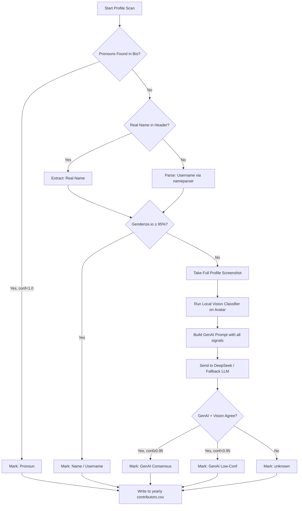

# WikiHow Contributor Analysis — Project Master Reference

> **Status**: Active Development | **Last Updated**: April 2026

---

## 1. Project Objective

This research project analyzes **gender-based participation and gatekeeping patterns** on WikiHow across different topical continuums. The core questions are:

- Do certain article topics attract disproportionate editing by one gender?
- Do higher-privileged users (admins, boosters) skew toward a particular gender?
- What forms of problematic contribution occur (vandalism, sexist edits, sarcasm)?
- How have these patterns shifted over time (2005–present)?

---

## 2. Database Structure

### 2.1 Folder Organization

```
data/
  authors/
    contributors.csv      ← MASTER flat registry of ALL known authors
                            One row per person. Always global, never split.
                            Updated in-place when a profile is rescanned.
  db/
    YYYY/
      articles.csv        ← Articles whose FIRST REVISION was in that year
      revisions.csv       ← All edits made in that year (FK → authors)
    YYYY/
      articles.csv
      revisions.csv
```

**Key design rules**:
- **Authors are global** — `contributors.csv` has one row per `username` regardless of when they joined or edited. `year` (join year) is just a column.
- **Activity is time-scoped** — `db/YYYY/` folders key on the **year of the event** (when an article was created, when a revision was made), not the author's join year.
- **Year folders are auto-created** on demand — if a 2004 article or a 2026 article appears, `db_manager.year_dir(year)` creates the folder automatically.
- **Cross-year queries** use `db_manager.load_activity('articles')` which concatenates all years.

### 2.2 Authors Schema (`contributors.csv`)

| Variable | Type | Description |
| :--- | :--- | :--- |
| `username` | String | WikiHow username. **Primary Key.** |
| `profile_url` | String | Full URL to user page. |
| `real_name` | String | Extracted real name from profile header box. |
| `location` | String | Extracted location (e.g., "Dubai"). |
| `year` | Integer | Approximate join year (derived from tenure). |
| `tenure` | String | Raw tenure string (e.g., "over 18 years!"). |
| `edit_count` | Integer | Total article edits. |
| `pronoun` | String | Extracted pronouns (she/her, he/him, they/them). |
| `gender` | String | Final inferred gender (`male`, `female`, `non-binary`, `unknown`). |
| `identity_tags` | String | Comma-separated specific identity markers (e.g., `lesbian, pansexual`). |
| `gender_source` | String | Decision layer: `Pronoun`, `Name`, `Username`, `GenAI`, `unknown`. |
| `gender_confidence` | Float | Confidence score 0.0–1.0. Target ≥ 0.95. |
| `badges` | JSON | List of badges: `ADMIN`, `BOOSTER`, `FEATURED`, `WIKIHAUS`, etc. |
| `image_ai_guess` | String | Gender guess from local vision classifier. |
| `genai_raw_json` | JSON | Full GenAI response for auditing (status, how_predicted, identity_tags). |

### 2.3 Articles Schema (`articles.csv`)

| Variable | Type | Description |
| :--- | :--- | :--- |
| `article_id` | Integer | WikiHow page ID. |
| `title` | String | Article title. |
| `category` | String | Category / continuum label. |
| `continuum` | String | `domestic`, `occupational`, `entertainment`, `policy`. |
| `starter_username` | String | Username of the user who created the article (first revision). |
| `starter_gender` | String | Gender of the starter (FK to contributors). |
| `total_revisions` | Integer | Total number of revisions collected. |
| `female_editors` | Integer | Count of distinct female editors. |
| `male_editors` | Integer | Count of distinct male editors. |
| `unknown_editors` | Integer | Count of distinct unknown-gender editors. |
| `female_bytes_added` | Integer | Total bytes added by female editors. |
| `male_bytes_added` | Integer | Total bytes added by male editors. |
| `female_bytes_removed` | Integer | Total bytes removed by female editors. |
| `male_bytes_removed` | Integer | Total bytes removed by male editors. |

### 2.4 Revisions Schema (`revisions.csv`)

| Variable | Type | Description |
| :--- | :--- | :--- |
| `rev_id` | Integer | Revision ID. **Primary Key.** |
| `article_id` | Integer | Article FK. |
| `username` | String | Editor username. |
| `gender` | String | Editor gender (resolved at analysis time). |
| `timestamp` | DateTime | Revision timestamp. |
| `bytes_delta` | Integer | Positive = added, negative = removed. |
| `diff_text` | Text | The actual text content added/removed (for classification). |
| `change_type` | String | Classification: `constructive`, `vandalism`, `sexist`, `sarcasm`, `revert`, `unknown`. |
| `change_confidence` | Float | Classifier confidence for `change_type`. |

---

## 3. Research Hypotheses

| ID | Hypothesis | Key Variables |
| :--- | :--- | :--- |
| H1 | Female-coded topics attract more female editors | `category`, `gender`, `edit_count` |
| H2 | Contribution volume diverges from editor count | `bytes_added`, `gender`, `category` |
| H3 | Gender patterns shift across time periods | `year`, `gender`, `category` |
| H4 | Genders differ in additive vs. subtractive edits | `bytes_delta`, `gender` |
| H5 | Stereotyping strength varies by continuum | `continuum`, `gender` |
| H6 | Neutral categories show balanced participation | `category`, `gender` |
| H7 | Some categories defy expected stereotypes | `category`, `gender` |
| H8 | Admins/Boosters skew male (gatekeeping) | `badges`, `gender`, `year` |

---

## 4. Visualizations

The full 14-graph structural architecture detailing demographic, categorical, dyadic, and behavioral shifts has been finalized. 

Please refer to the comprehensive structural document:
👉 **[docs/planning/visualization_manifest.md](planning/visualization_manifest.md)**

This manifest divides the 14 visualizations into four core sections:
1. **Section A: Demographics & User Lifecycles** (Cohorts, Dormancy Decay, Regional Maps)
2. **Section B: The Task Continuums** (Categorical breakdowns, Longitudinal trends, Gender Flips)
3. **Section C: Gatekeeping, Vandalism & Toxicity** (Perpetrator-Target Matrices, Typologies, Gatekeeping Dyads)
4. **Section D: Advanced Behavioral & Ideological Shifts** (Domain Flow, Chilling Effects, Kaplan-Meier Survival)

---

## 5. Continuums Under Study

### Domestic & Household
`Baby Toys · Elder Abuse · Baking · Laundry · Household Hair Colorants · Interior Walls · Gardening · Home Appliances · Plumbing`

### Occupational & Professional
`Nursing Careers · Human Resources · Business · Darts · Physics · Software · Mechanical Puzzles · Industrial Machinery`

### Entertainment & Leisure
`Knitting · Dancing · Poetry · Social Media · Photography · Board Games · DIY · Protection Against Hacking`

### Public Policy & Governance
`User Education · Animal Welfare Activism · Foreign Exchange · Law Enforcement · Military Clothing · Turbans`

---

## 6. Gender Inference Pipeline



**Priority Rules**:
1. Pronouns are deterministic (confidence = 1.0).
2. Do NOT infer gender from gendered words in bio text (woman, girl etc.) unless self-identified.
3. Genderize.io is only called via **Tor proxy** as fallback against rate limits.
4. Threshold: ≥ 0.95 for `Name` source acceptance; GenAI can override even with lower confidence if Visual confirms.

---

## 7. GenAI Prompt (DeepSeek)

Used during Phase 4 for low-confidence or unknown profiles.

**System Role**: You are an expert sociolinguistic researcher and data analyst specializing in gender identity detection from online personas.

**Task**: Analyze the provided screenshot of a wikiHow user profile and the metadata below to determine the user's gender and specific identity markers.

**Metadata Template**:
```
Username: {{username}}
Real Name (Extracted): {{real_name}}
Location: {{location}}
Algorithm Guess (Genderize.io): {{genderize_guess}} (confidence: {{genderize_confidence}})
Vision Guess (Local Image AI): {{image_ai_guess}}
```

**Instructions**:
1. IGNORE the "Meet a Community Member" section — it is a generic site feature.  
2. PRIORITIZE direct self-identification (e.g., "I am a woman", "she/her").  
3. ANALYZE the "About Me" text for identities beyond binary (agender, genderfluid, etc.).  
4. CHECK for orientation/identity markers: lesbian, pansexual, transgender, etc.  
5. CONSIDER Real Name + Location alignment with visual evidence.  
6. OVERRIDE the algorithm guesses if bio text explicitly states otherwise.  
7. MULTI-DIMENSIONAL: If a user mentions multiple identities, include all as `identity_tags`.  
8. Safety: No stereotyping. If ambiguous, return `unknown`.

**Output** (raw JSON, no code block):
```json
{
  "status": "female | male | non-binary | prefer not to say | unknown",
  "identity_tags": ["lesbian", "pansexual"],
  "confidence": 0.97,
  "source": "Bio | Header | Username | Visual | Combination",
  "how_predicted": "Step-by-step reasoning"
}
```

---

## 8. Contribution Classification (Change Types)

Future NLP task to classify each revision's `diff_text`:

| Type | Description | Detection Method |
| :--- | :--- | :--- |
| `constructive` | Adds factual, helpful content | Positive bytes, no flags |
| `vandalism` | Nonsense, profanity, link spam | Pattern match + GenAI |
| `sexist` | Gendered insults or stereotyping language | Lexicon + GenAI |
| `sarcasm` | Mocking tone without factual contribution | GenAI |
| `revert` | Undoes a previous revision | `-bytes`, edit summary keywords |
| `unknown` | Insufficient signal | Default |

**Target**: Improve classifier to detect subtle sexism and sarcasm using DeepSeek with diff context.

---

## 9. Technical Notes

- **Browser**: SeleniumBase (UC mode, profile cached at `data/browser_session/`).
- **Tor**: Used only for Genderize.io calls (`socks5://127.0.0.1:9050`). Page scraping uses direct connection.
- **DeepSeek**: Custom browser-based engine at `http://localhost:8002`. See `wikihow/llm_engine.py`.
- **Login requirement**: Browser session must be logged into **WikiHow** and **DeepSeek** before scraping begins.
- **Fallback LLM order**: `deepseek_custom → deepseek_api → gemini`.
